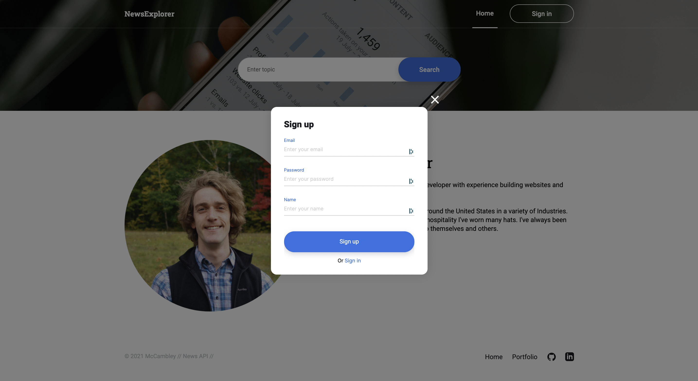
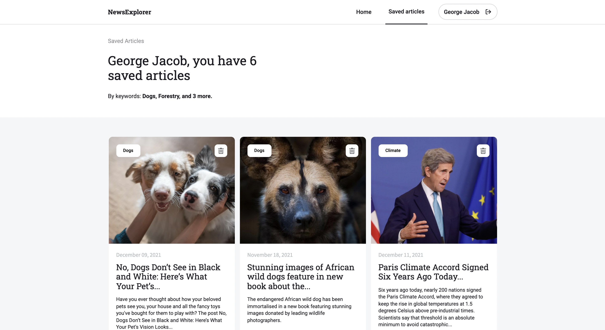

<h1 align="center" ><a href="https://mccambley.github.io/news-explorer-frontend/">View this project live!</a>🎉</h1>

<h2 align="center">This repository contains the frontend code for <a href="https://mccambley.github.io/news-explorer-frontend/">NewsExplorer</a>, the final project in the Practicum by Yandex curriculum.<br>Check out a demonstration of this project <a target="_blank" href="https://youtu.be/q7IdngTegY8">here</a>.</h2>

## 📣 Overview

- Search news from all over the world pertaining to a specific topic
- Login or Register to save articles to your reading list
- Return to your reading list on your account from any device to view saved articles sorted by keyword popularity

## 🛠 Technologies

- **Stack**: React, TypeScript, Node.js, Express.js, and MongoDB
- **Styled-components** make the frontend look good
- **Mongoose** manages the data
- **Google Cloud** hosts the backend
- **News API** provides the news

## ✨ Screenshots - [Live Demo](https://youtu.be/q7IdngTegY8)

### Search


### Register



### Saved Articles



---

## 🧑‍💻 Get Started

**Clone**

```
$ git clone https://github.com/McCambley/news-explorer-frontend.git
```

**Install**

```
$ cd news-explorer-frontend
$ npm i
```

**Launch**

```
$ npm run start
```

---

## 🔗 Important Links

- ### [Frontend Deployment](https://mccambley.github.io/news-explorer-frontend/)
- ### [Backend API](https://api.mccambley-news.students.nomoreparties.sbs/)
- ### [Backend Repository](https://github.com/McCambley/news-explorer-api)

## 🔜 Next Steps

- Allow for custom sorting of saved articles
- Implement custom filtration of specific news outlets as determined by the user
